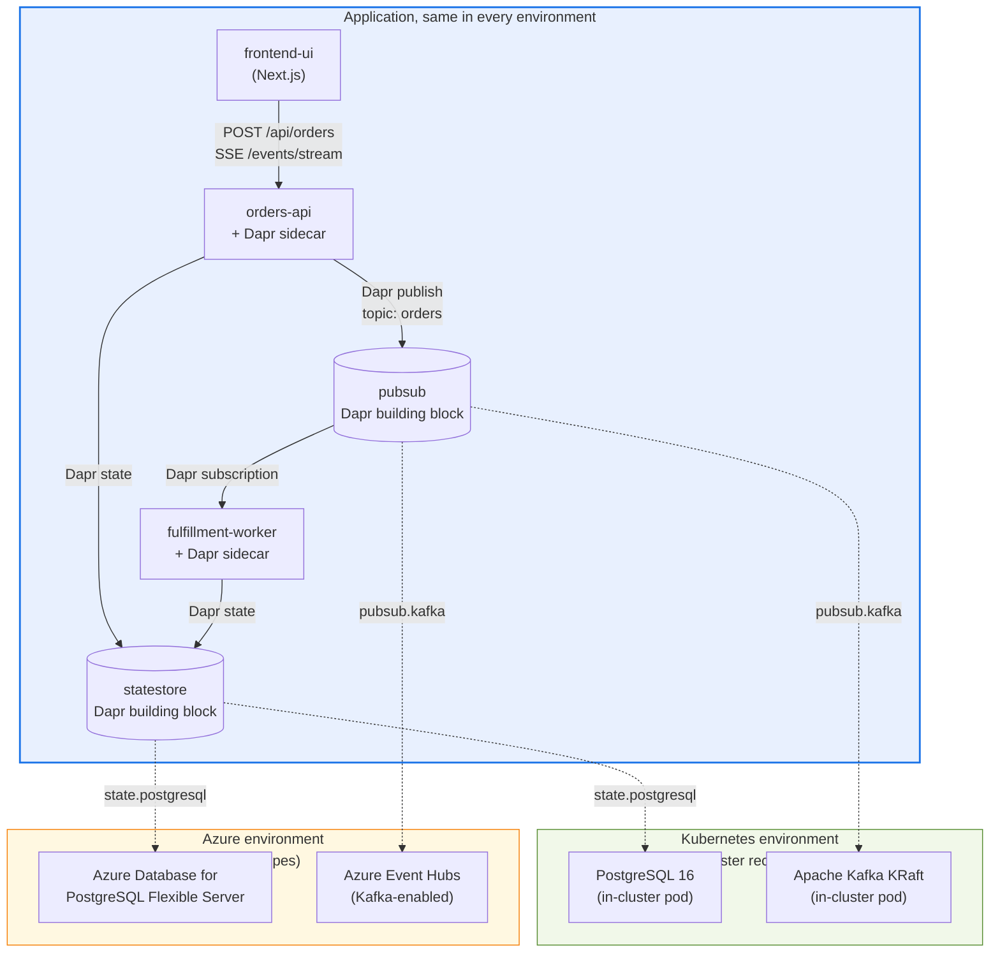

# Walking the order-console sample: Dapr and Radius in practice

This is the technical companion to the Microsoft Open Source Blog post *Designing for cloud sovereignty with Dapr and Radius*. The blog post explains why Dapr and Radius are useful together. This document walks the [order-console](https://github.com/radius-project/lab/tree/main/002-order-console) sample, contributed by Reshma Rahim and maintained in the official Radius project labs at `radius-project/lab`, end to end so you can run it yourself and see the portability story in code.

## What the sample demonstrates

`order-console` is a three-service order-management application:

| Service              | Responsibility                                                         | Dapr building blocks used         |
|----------------------|------------------------------------------------------------------------|-----------------------------------|
| `frontend-ui`        | Next.js UI for placing orders and viewing status                       | None (calls `orders-api` over HTTP) |
| `orders-api`         | Accept submissions, persist orders, publish order events, expose SSE   | State Management, Pub/Sub (publisher) |
| `fulfillment-worker` | Subscribe to order events, process fulfillment, update order state     | Pub/Sub (subscriber), State Management |

The same `radius/app.bicep` deploys this application to either of two Radius environments:

- A **Kubernetes environment**, where in-cluster PostgreSQL and Apache Kafka (KRaft) back the Dapr state store and pub/sub broker.
- An **Azure environment**, where Azure Database for PostgreSQL Flexible Server and Azure Event Hubs (Kafka-enabled) back the same Dapr building blocks.

Application code, container images, and Dapr component names are identical across both. Only the Recipes registered against each environment change.

## Architecture



The Dapr building blocks (`statestore`, `pubsub`) sit at the application boundary. The dotted lines from those blocks into the two environments show the alternative bindings. At deploy time, exactly one set of Recipes runs and provides the actual backing infrastructure.

## Repository layout

The relevant files in [`radius-project/lab/002-order-console`](https://github.com/radius-project/lab/tree/main/002-order-console) are:

- [`radius/types.yaml`](https://github.com/radius-project/lab/blob/main/002-order-console/radius/types.yaml): user-defined Resource Type definitions for `Radius.Dapr/stateStores` and `Radius.Dapr/pubSubBrokers`
- [`radius/app.bicep`](https://github.com/radius-project/lab/blob/main/002-order-console/radius/app.bicep): the application definition (three containers, two Dapr building blocks, sidecar extensions, connections)
- [`radius/environments/kubernetes.bicep`](https://github.com/radius-project/lab/blob/main/002-order-console/radius/environments/kubernetes.bicep): registers in-cluster Recipes
- [`radius/environments/azure.bicep`](https://github.com/radius-project/lab/blob/main/002-order-console/radius/environments/azure.bicep): registers Azure Recipes
- [`radius/recipes/stateStores/{kubernetes,azure}/main.tf`](https://github.com/radius-project/lab/tree/main/002-order-console/radius/recipes/stateStores): Terraform Recipes for the state store
- [`radius/recipes/pubSubBrokers/{kubernetes,azure}/main.tf`](https://github.com/radius-project/lab/tree/main/002-order-console/radius/recipes/pubSubBrokers): Terraform Recipes for the pub/sub broker
- [`services/`](https://github.com/radius-project/lab/tree/main/002-order-console/services): the three service source trees

## Two Radius patterns drive the application model

Both patterns are documented in the [Radius Dapr guides](https://docs.radapp.io/guides/author-apps/dapr/overview/). The order-console sample applies them as follows.

### Pattern one: Dapr building blocks as Radius resources

The state store and pub/sub broker are declared as Radius resources of user-defined types from `radius/types.yaml`:

```bicep
resource statestore 'Radius.Dapr/stateStores@<api-version>' = {
  name: 'statestore'
  properties: {
    application: app.id
    environment: environment
  }
}

resource pubsub 'Radius.Dapr/pubSubBrokers@<api-version>' = {
  name: 'pubsub'
  properties: {
    application: app.id
    environment: environment
  }
}
```

There is no SKU, no region, no broker URL, no connection string. The application file does not know whether `statestore` resolves to in-cluster Postgres or Azure Database for PostgreSQL Flexible Server. At deploy time, Radius looks up the Recipe registered for each Resource Type in the active environment, runs it (Terraform in this sample), and uses its outputs to generate the Dapr component YAML on the cluster.

### Pattern two: containers with Dapr sidecars

Each service is an `Applications.Core/containers` resource with a `daprSidecar` extension and `connections` to the Dapr building blocks declared above:

```bicep
resource ordersApi 'Applications.Core/containers@2023-10-01-preview' = {
  name: 'orders-api'
  properties: {
    application: app.id
    container: {
      image: '...'
      ports: { web: { containerPort: 3000 } }
    }
    extensions: [
      { kind: 'daprSidecar', appId: 'orders-api', appPort: 3000 }
    ]
    connections: {
      statestore: { source: statestore.id }
      pubsub:     { source: pubsub.id }
    }
  }
}
```

The `connections` block wires the container to the Dapr building blocks. Radius injects connection environment variables into the container and generates the matching Dapr component configuration on the cluster. The developer never writes Dapr component YAML by hand.

> Refer to the actual files in the repo for current parameter names, registry conventions, and the exact API version of the user-defined Resource Types.

## How the application code uses Dapr

The order-console services are written in TypeScript and use the `@dapr/dapr` SDK. The application code talks to Dapr abstractions, never directly to PostgreSQL or Kafka. The shape of the calls (per the [Dapr JavaScript SDK documentation](https://docs.dapr.io/developing-applications/sdks/js/js-client/)):

```typescript
import { DaprClient } from "@dapr/dapr";

const client = new DaprClient();

// Persist an order via Dapr state (never touches PostgreSQL directly)
await client.state.save("statestore", [
  { key: order.id, value: order }
]);

// Publish an order event via Dapr pub/sub (never touches Kafka directly)
await client.pubsub.publish("pubsub", "orders", {
  orderId: order.id,
  status: "created",
});
```

The state store named `statestore` and the pub/sub broker named `pubsub` are the Dapr component names. Whether they resolve to in-cluster Postgres/Kafka or to Azure PostgreSQL Flexible Server/Event Hubs is an environment-level decision.

## Environments and Recipes

The repo provides two environments under `radius/environments/`:

- **`kubernetes.bicep`**: registers Recipes that provision in-cluster PostgreSQL (state store) and in-cluster Kafka in KRaft mode (pub/sub).
- **`azure.bicep`**: registers Recipes that provision Azure Database for PostgreSQL Flexible Server and Azure Event Hubs (Kafka-enabled).

The Recipes live under `radius/recipes/` and are written in **Terraform**, which Radius supports as a first-class IaC option alongside Bicep.

| Resource Type                 | Kubernetes Recipe                                  | Azure Recipe                                                        |
|-------------------------------|----------------------------------------------------|---------------------------------------------------------------------|
| `Radius.Dapr/stateStores`     | PostgreSQL 16 in-cluster, Dapr `state.postgresql`  | Azure Database for PostgreSQL Flexible Server, Dapr `state.postgresql` |
| `Radius.Dapr/pubSubBrokers`   | Apache Kafka (KRaft) in-cluster, Dapr `pubsub.kafka` | Azure Event Hubs (Kafka-enabled), Dapr `pubsub.kafka`              |

The Dapr component *type* is the same in both environments (`state.postgresql`, `pubsub.kafka`). The component *implementation* (connection string, broker URL, credentials, SKU) comes from whichever Recipe ran. The application sees neither.

## Deploying the sample

After installing Radius and Dapr on a Kubernetes cluster:

```bash
# 1. Clone the lab repo and enter the order-console lab
git clone https://github.com/radius-project/lab.git
cd lab/002-order-console

# 2. Create the user-defined Resource Types
rad resource-type create -f radius/types.yaml

# 3. Pick an environment and deploy it
rad group create local
rad deploy radius/environments/kubernetes.bicep --group local

# Or, for the Azure environment:
rad group create azure
rad deploy radius/environments/azure.bicep --group azure \
  -p azureSubscriptionId=$(az account show --query id -o tsv) \
  -p azureResourceGroup=order-console \
  -p location=westus3

# 4. Deploy the application (same app.bicep in either case)
rad workspace switch <local|azure>
rad deploy radius/app.bicep
```

`rad deploy` resolves each Resource Type in `app.bicep` to the Recipe registered in the active environment, runs the Terraform, generates the Dapr component configurations, deploys the three service containers with Dapr sidecars, and wires the connections. The deployment output looks like:

```
Completed   order-console        Applications.Core/applications
Completed   statestore           Radius.Dapr/stateStores
Completed   pubsub               Radius.Dapr/pubSubBrokers
Completed   frontend-ui          Applications.Core/containers
Completed   fulfillment-worker   Applications.Core/containers
Completed   orders-api           Applications.Core/containers
```

Port-forward the `frontend-ui` service to access the UI. Port-forward `dashboard` from the `radius-system` namespace to view the Radius Application Graph.

## Extending the pattern for compliance and sovereignty

The sample uses user-defined Resource Types under the `Radius.Dapr` namespace. Built-in `Applications.Dapr/*` types continue to coexist; built-ins are not deprecated. The convention for new user-defined types is `Radius.<Category>` or an organization-specific namespace such as `Contoso.Data`.

For regulated workloads, organizations can define Resource Types that encode compliance requirements directly in the type schema. A `Contoso.Data/regulatedStateStore` type might require properties like `dataResidency`, `encryptionMode`, and `auditLogDestination`, making it impossible for developers to provision a database that violates organizational policy regardless of which environment they target. Compliance moves into the type system instead of living in tribal knowledge or PR review checklists. Per-environment Recipes implement each region's specific requirements.

The same pattern extends to other compute targets. AKS enabled by Azure Arc on Azure Local (Microsoft's hybrid platform for running Azure services in customer datacenters, formerly Azure Stack HCI) is a Radius environment like any other. Authoring Recipes that target on-premises infrastructure and registering them in a new environment is what enables an application to move from Azure public cloud to a customer datacenter without code changes.

## References

- [order-console sample](https://github.com/radius-project/lab/tree/main/002-order-console)
- [Radius documentation](https://docs.radapp.io/)
- [Radius Resource Types](https://docs.radapp.io/concepts/resource-types/)
- [Radius Dapr guides](https://docs.radapp.io/guides/author-apps/dapr/overview/)
- [Radius Terraform Recipes overview](https://docs.radapp.io/guides/recipes/terraform/overview/)
- [Dapr documentation](https://docs.dapr.io/)
- [Dapr building blocks overview](https://docs.dapr.io/concepts/building-blocks-concept/)
- [Dapr JavaScript SDK](https://docs.dapr.io/developing-applications/sdks/js/js-client/)
