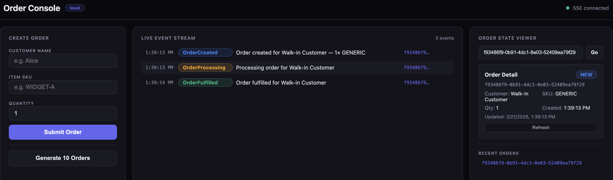
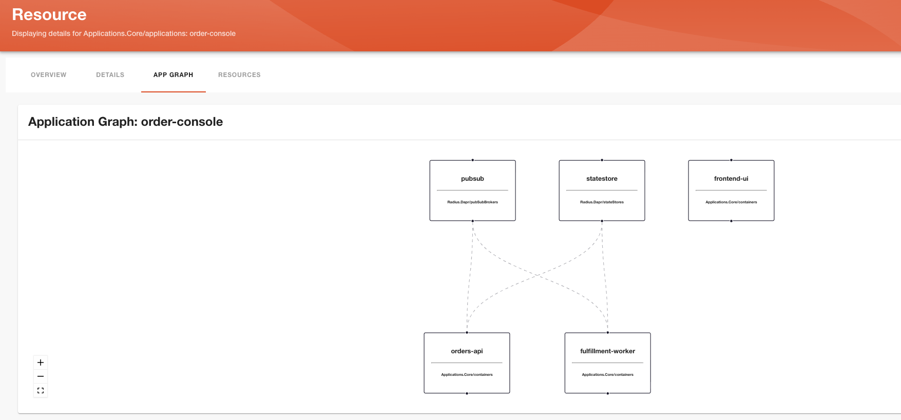

# Order Management Console – Microservices with Radius and Dapr

This sample demonstrates how to build and deploy a **microservices order-management application** using [Radius](https://radapp.io), an open-source application platform that enables developers and platform engineers to define, deploy, and manage cloud-native applications across any infrastructure.

## Why Radius?

Building microservices that run in multiple environments (Kubernetes, Azure, AWS) is painful. A developer who uses [Dapr](https://dapr.io) for state management and pub/sub messaging still has to manually provision the backing infrastructure — a PostgreSQL database, a Kafka broker, or their cloud equivalents differently in every environment. Configuration drift, inconsistent deployments, and "it works on my machine" issues follow.

Radius solves this by enabling **platform engineers** to define abstract, application-oriented **Resource Types** and, separately, **Recipes** which implement those Resource Types using Infrastructure as Code (IaC). The developer just declares what application resources (a state store, a pub/sub broker, containers) they need in an application definition and Radius handles the deployment of the correct infrastructure for the target environment.

## Order Management Console Application

This sample is an order management console with three microservices communicating via Dapr. A customer creates orders through a Next.js frontend, the orders API persists state and publishes events, and a fulfillment worker processes those events asynchronously.

<p align="center">
  
</p>

At the completion of this walkthrough, the Radius application graph will look like:

<p align="center">
  
</p>

<details>
<summary>Architecture diagram and Dapr usage (click to expand)</summary>

```
┌──────────────┐  POST /api/orders  ┌─────────────┐  Dapr publish  ┌───────┐
│   Next.js UI │ ─────────────────► │ orders-api  │ ─────────────► │ Kafka │
│              │  SSE /events/stream│ (port 3000) │  topic:orders  └───┬───┘
└──────────────┘ ◄───────────────── └──────┬──────┘                    │
                                           │ Dapr state                │ Dapr subscription
                                           ▼                           ▼
                                    ┌────────────┐            ┌────────────────────┐
                                    │ PostgreSQL │ ◄───────── │ fulfillment-worker │
                                    │(statestore)│  Dapr state│    (port 3002)     │
                                    └────────────┘            └────────────────────┘
```

| Component            | What it does                                                         |
|----------------------|----------------------------------------------------------------------|
| `orders-api`         | Accept submissions, persist orders, publish order events, expose SSE |
| `fulfillment-worker` | Subscribe to order events, process fulfillment, update order state   |
| `frontend-ui`        | Next.js UI for placing orders and viewing status                     |
| `statestore`         | Dapr state component backed by PostgreSQL                            |
| `pubsub`             | Dapr pub/sub component backed by Kafka or Azure Event Hubs           |

The services use the `@dapr/dapr` SDK and talk only to Dapr abstractions — never directly to PostgreSQL or Kafka:

```typescript
// Persist an order via Dapr state (never touches PostgreSQL directly)
await client.state.save("statestore", [{ key: order.id, value: order }]);

// Publish an order event via Dapr pub/sub (never touches Kafka directly)
await client.pubsub.publish("pubsub", "orders", { orderId: order.id, status: "created" });
```

</details>

## 📁 Repository structure

```
002-order-console/
├── README.md
├── images/                     # Screenshots
│   ├── order-console.png
│   └── radius-dashboard.png
├── radius/
│   ├── app.bicep              # Application definition (what the developer writes)
│   ├── bicepconfig.json
│   ├── environments/          # azure.bicep, kubernetes.bicep
│   ├── recipes/
│   │   ├── azure/             # pubsub/, statestore/ (Terraform)
│   │   └── kubernetes/        # pubsub/, statestore/ (Terraform)
│   ├── dapr/components/       # Dapr component YAML configs
│   ├── extensions/            # radiusdapr.tgz
│   └── types.yaml             # Dapr resource type definitions
├── src/
│   ├── orders-api/            # Order API service (Express.js)
│   ├── fulfillment-worker/    # Fulfillment worker (Express.js)
│   └── ui/                    # Next.js frontend
```

## 🎯 Goals

By the end of this walkthrough, you will:

- Understand the Radius concepts of **Resource Types**, **Recipes**, **Environments**, and **Applications**
- See how custom abstractions (like `Radius.Dapr/stateStores` and `Radius.Dapr/pubSubBrokers`) let developers declare infrastructure needs without knowing the underlying implementation
- Deploy a microservices application to **Kubernetes** or **Kubernetes + Azure** with the same `app.bicep`

## ✅ Prerequisites

- [kubectl](https://kubernetes.io/docs/tasks/tools/#kubectl)
- [Radius CLI](https://docs.radapp.io/tutorials/install-radius/#install-the-radius-cli)
- A Kubernetes cluster (or [AKS cluster](https://learn.microsoft.com/azure/aks/) for Azure deployments) with [Dapr](https://docs.dapr.io/operations/hosting/kubernetes/kubernetes-deploy/) installed. Your user must have the **cluster-admin** role.

**For Azure deployment:**

- [Azure CLI](https://learn.microsoft.com/cli/azure/install-azure-cli)
- [Azure cloud provider configured in Radius](https://docs.radapp.io/guides/operations/providers/azure-provider/)

---

## 🚀 Walkthrough

### Step 1: Clone the repository

```bash
git clone https://github.com/radius-project/lab.git
cd lab/002-order-console/
```

### Step 2: Install Radius on the Kubernetes cluster

If you haven't already installed Radius, do so now:

```bash
rad install kubernetes
```

Verify the installation:

```bash
kubectl get pods -n radius-system
```

You should see all Radius pods running:

```
NAME                READY   STATUS    RESTARTS   AGE
applications-rp      1/1     Running   0          1m
bicep-de             1/1     Running   0          1m
contour-contour      1/1     Running   0          1m
contour-envoy        1/1     Running   0          1m
controller           1/1     Running   0          1m
dashboard            1/1     Running   0          1m
dynamic-rp           1/1     Running   0          1m
ucp                  1/1     Running   0          1m
```

### Step 3: Create the Resource Types required by the application

Resource Types are abstract application resources that are infrastructure/cloud provider-agnostic. They define the properties that developers can set when they declare resources in their `app.bicep`, and they map to recipes that provision the underlying infrastructure.

Register the Dapr resource types with Radius:

```bash
rad resource-type create -f radius/types.yaml
```

This registers two types:

- **`Radius.Dapr/stateStores`** — represents a Dapr state store (backed by PostgreSQL)
- **`Radius.Dapr/pubSubBrokers`** — represents a Dapr pub/sub broker (backed by Kafka or Event Hubs)

Verify the types were created:

```bash
rad resource-type list
```

```
TYPE                                    NAMESPACE                APIVERSION
Applications.Core/applications          Applications.Core        ["2023-10-01-preview"]
...
Radius.Dapr/pubSubBrokers               Radius.Dapr              ["2025-08-01-preview"]
Radius.Dapr/stateStores                 Radius.Dapr              ["2025-08-01-preview"]
```

<details>
<summary>Learn about Bicep extensions (click to expand)</summary>

Bicep extensions are needed for each Resource Type to provide type safety and autocompletion in VS Code (when the Bicep extension is installed). These extensions are defined in the `bicepconfig.json` file. As part of this sample, a preconfigured `bicepconfig.json` referencing the pre-generated Bicep extension in the `radius/extensions/` directory is provided. No action needed.

If you modify the `types.yaml`, regenerate the extension:

```bash
rad bicep publish-extension -f radius/types.yaml --target radius/extensions/radiusdapr.tgz
```
</details>

### Step 4: Create the Radius Environment

A Radius Environment is where you configure *which* recipes to use and *where* infrastructure resources should be provisioned. This sample supports two deployment paths — pick the one that fits your scenario.

| Path | What it does | Jump to |
|------|-------------|---------|
| **Kubernetes** | All infrastructure (PostgreSQL, Kafka) runs in-cluster | [Kubernetes ↓](#kubernetes) |
| **Kubernetes + Azure** | Containers on Kubernetes, databases & messaging in Azure | [Kubernetes + Azure ↓](#kubernetes--azure) |

#### Kubernetes

Deploy everything (containers, PostgreSQL, Kafka) to your Kubernetes cluster.

Create a Radius resource group and deploy the Kubernetes environment:

```bash
rad group create local
rad deploy radius/environments/kubernetes.bicep --group local
```

Create a workspace so the `rad` CLI knows which environment and group to use by default:

```bash
rad workspace create kubernetes local \
  --context $(kubectl config current-context) \
  --environment local \
  --group local
```

Confirm the environment was created:

```bash
rad environment show local
```

Verify recipes were registered:

```bash
rad recipe list
```

```
RECIPE    TYPE                          TEMPLATE KIND  TEMPLATE
default   Radius.Dapr/stateStores       terraform      git::https://github.com/radius-project/lab.git//002-order-console/radius/recipes/kubernetes/statestore
default   Radius.Dapr/pubSubBrokers     terraform      git::https://github.com/radius-project/lab.git//002-order-console/radius/recipes/kubernetes/pubsub
```

> [!TIP]
> Skip to [Step 5: Deploy the application](#step-5-deploy-the-application) after completing the Kubernetes path.

#### Kubernetes + Azure

Deploy containers to Kubernetes and provision PostgreSQL (Azure Database for PostgreSQL) and Kafka (Azure Event Hubs) in Azure.

> [!NOTE]
> Follow the instructions in the [Azure provider guide](https://docs.radapp.io/guides/operations/providers/azure-provider/) to register your Azure credentials with Radius before proceeding.

Create an Azure resource group for the infrastructure:

```bash
az group create --name order-management-console --location <location>
```

Create a Radius resource group and deploy the Azure environment:

```bash
rad group create azure
rad deploy radius/environments/azure.bicep --group azure \
  -p azureSubscriptionId=$(az account show --query id -o tsv) \
  -p azureResourceGroup=order-management-console \
  -p location=$(az group show --name order-management-console --query location -o tsv)
```

Create a workspace:

```bash
rad workspace create kubernetes azure \
  --context $(kubectl config current-context) \
  --environment azure \
  --group azure
```

Confirm the environment was created:

```bash
rad environment show azure
```

Verify recipes were registered:

```bash
rad recipe list
```

```
RECIPE    TYPE                          TEMPLATE KIND  TEMPLATE
default   Radius.Dapr/stateStores       terraform      git::https://github.com/radius-project/lab.git//002-order-console/radius/recipes/azure/statestore
default   Radius.Dapr/pubSubBrokers     terraform      git::https://github.com/radius-project/lab.git//002-order-console/radius/recipes/azure/pubsub
```

<details>
<summary>Learn about Recipes in this sample (click to expand)</summary>

Recipes are Terraform configurations stored in this Git repository. Because it's a public GitHub repository, no additional authentication is needed. If you stored the Terraform configurations in a private repository, you would need to provide Radius with an [access token](https://docs.radapp.io/guides/recipes/terraform/howto-private-registry/).

**Kubernetes Recipes**

- `radius/recipes/kubernetes/statestore/main.tf` — PostgreSQL 16 deployed in-cluster with a Dapr `state.postgresql` component
- `radius/recipes/kubernetes/pubsub/main.tf` — Apache Kafka (KRaft mode) deployed in-cluster with a Dapr `pubsub.kafka` component

**Azure Recipes**

- `radius/recipes/azure/statestore/main.tf` — Azure Database for PostgreSQL Flexible Server with a Dapr `state.postgresql` component
- `radius/recipes/azure/pubsub/main.tf` — Azure Event Hubs (Kafka-enabled) with a Dapr `pubsub.kafka` component

If you'd like to learn to create and publish your own Recipes, read [this guide](https://docs.radapp.io/guides/recipes/howto-author-recipes/).

The Dapr component *type* (`state.postgresql`, `pubsub.kafka`) is the same in both environments. The *implementation* — connection string, broker URL, credentials, SKU — comes from whichever Recipe ran. The application sees neither.
</details>

### Step 5: Deploy the application

If you set up both environments and want to switch between them:

```bash
rad environment switch <environment-name>
```

Deploy the application:

```bash
rad deploy radius/app.bicep
```

> [!NOTE]
> Deployment takes 2–5 minutes for Kubernetes, or 15–20 minutes when provisioning Azure resources.

When the deployment is complete, you should see output similar to:

```
Deployment In Progress...

Completed            order-management-console   Applications.Core/applications
Completed            statestore      Radius.Dapr/stateStores
Completed            pubsub          Radius.Dapr/pubSubBrokers
Completed            frontend-ui     Applications.Core/containers
Completed            fulfillment-worker Applications.Core/containers
Completed            orders-api      Applications.Core/containers

Deployment Complete

Resources:
    order-management-console   Applications.Core/applications
    frontend-ui     Applications.Core/containers
    fulfillment-worker Applications.Core/containers
    orders-api      Applications.Core/containers
    pubsub          Radius.Dapr/pubSubBrokers
    statestore      Radius.Dapr/stateStores
```

### Step 6: Access the application

Port-forward the frontend service to your local machine.

For the **Kubernetes** environment:

```bash
kubectl port-forward svc/frontend-ui 3000:3000 -n local-order-management-console
```

For the **Kubernetes + Azure** environment:

```bash
kubectl port-forward svc/frontend-ui 3000:3000 -n azure-order-management-console
```

Open **<http://localhost:3000>** in your browser to see the Order Management Console UI.

### Step 7: Access the Radius dashboard

Port-forward the Radius dashboard:

```bash
kubectl port-forward --namespace=radius-system svc/dashboard 7007:80
```

Open the application graph in your browser:

Replace `<group>` with `local` or `azure` depending on which environment you deployed:

```
http://localhost:7007/
```

---

## 🧹 Clean up

1. Delete the application:

    ```bash
    rad app delete -a order-management-console
    ```

1. (Azure only) Delete the Azure resource group:

    ```bash
    az group delete --name order-management-console --yes
    ```

1. Delete your Radius workspace:

    ```bash
    rad workspace delete local --yes
    ```

    Or for the Azure workspace:

    ```bash
    rad workspace delete azure --yes
    ```
