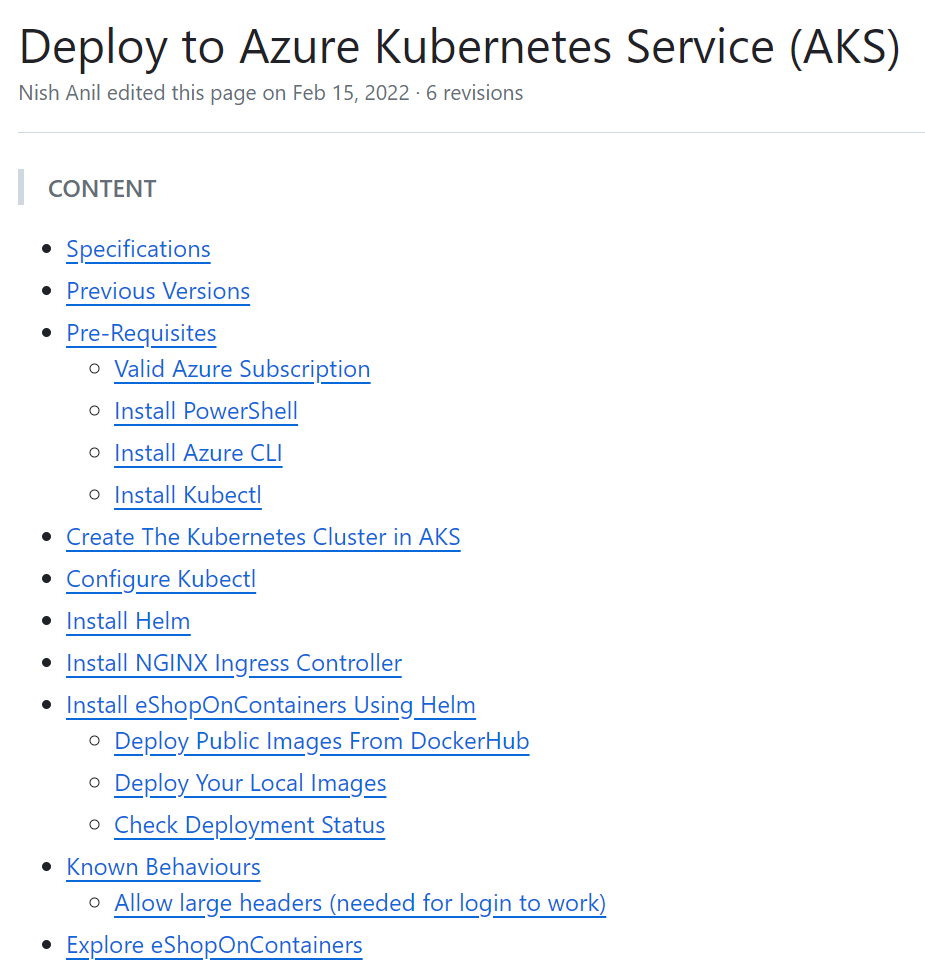
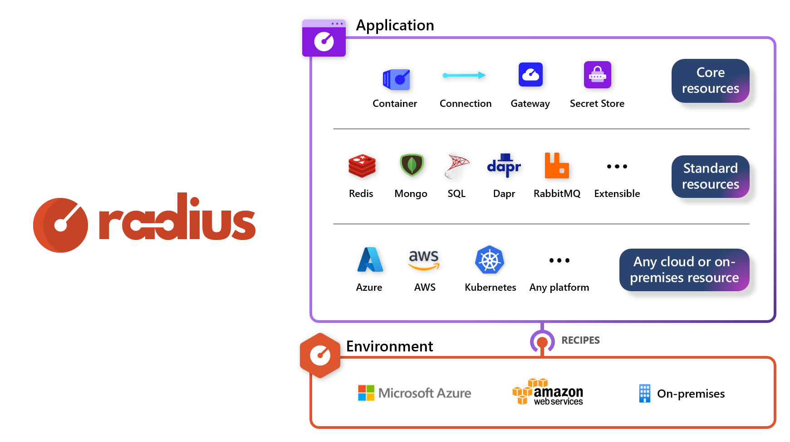
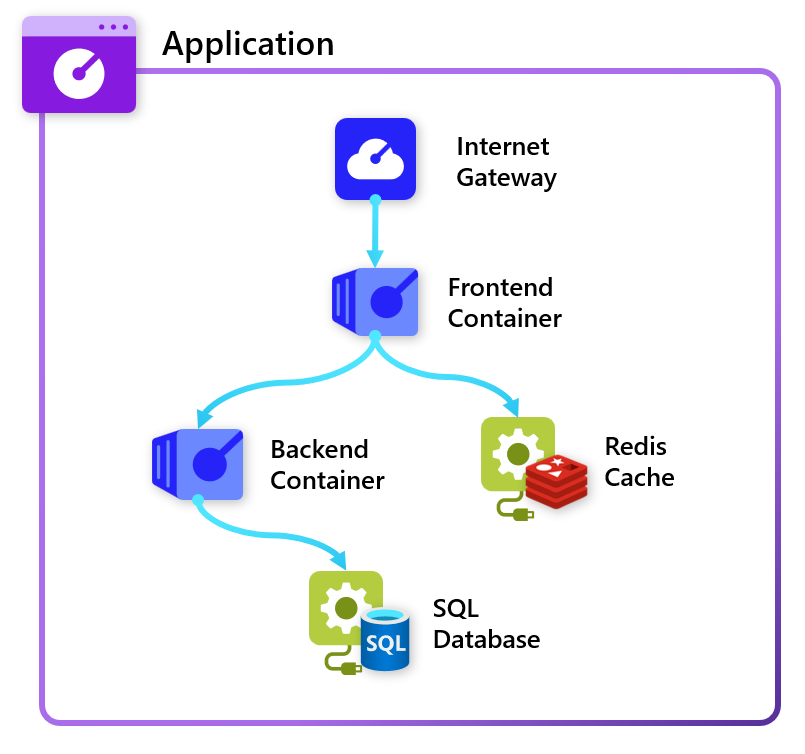
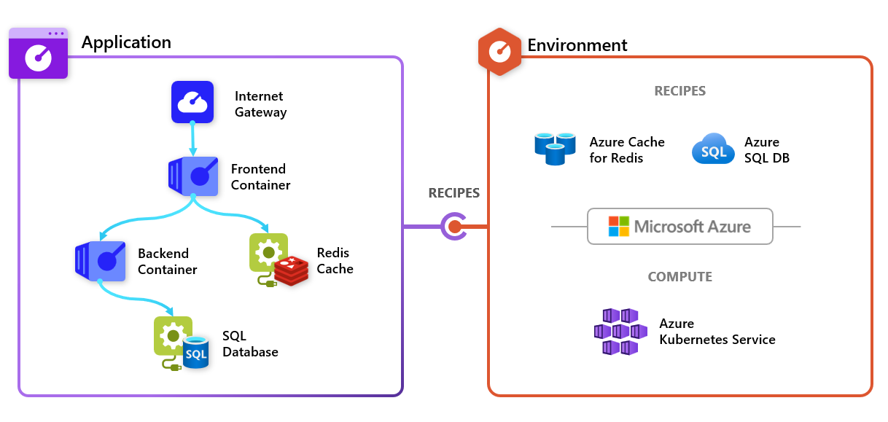

# Step 1: Welcome to the Radius lab

Welcome to the Radius lab! This page will walk you through some of the basic concepts, terms, and tools you'll need to know to get started.

## 1.1: What is Radius?

Radius is a new open-source, cloud-native application platform that enables developers and the platform engineers that support them to collaborate on delivering and managing cloud-native applications that follow organizational best practices for cost, operations and security, by default. Radius is an open-source project that supports deploying applications across private cloud, Microsoft Azure, and Amazon Web Services, with more cloud providers to come.

You can find us on GitHub at https://github.com/radius-project, and on our website at https://radapp.io. You can also follow us on X at [@radapp_io](https://x.com/radapp_io) and on Threads at [@radapp_io](https://www.threads.net/@radapp_io).

## Step 1.2: What is the pain-point Radius solves?

Let's take a look at a popular cloud-native application example, [eShop on Containers](https://github.com/dotnet-architecture/eShopOnContainers/blob/6.0.0/README.md) (_this lab references the 6.0 version of eShop, prior to it's Nov 2023 migration to Aspire_). Specifically, let's look at how this application is modeled and deployed.

### What is the application?

For eShop, let's think about "what is the application"? Is it the set of services defined in the Helm chart? Is it the backing infrastructure in the ARM JSON files? Is it the resultant set of resources you get when you deploy everything? To help answer this question, teams often have to create wikis, diagrams, or other documentation to describe "what is the app" instead of pointing to all of the deployment artifacts. For eShop, they created this diagram:

### How do I deploy the app?

The [eShop deployment instructions](https://github.com/dotnet-architecture/eShopOnContainers/wiki/Deploy-to-Azure-Kubernetes-Service-(AKS)) provide a long list of commands that need to be run, in order, to successfully deploy the application. This is a common pattern for cloud-native applications, and it's not uncommon to see a list of 10-20 commands that need to be run in order to deploy an application. Plus, developers are often tasked with understanding or running these commands and may deviate from your organization's requirements for cost, security, and compliance. CI/CD pipelines are often used to automate this process, but the end result is the same: lists of commands are required to deploy the lists of resources contained in templates.

### What if there was a better option?

Radius seeks to solve the problem of "what is an app?" and "how can my team safely and easily deploy it?" through two key concepts: the **Radius Application Graph**" and "**Environments + Recipes**". Together, they allow developers to define "this is my app and what it needs" and for IT operators to define "this is how we deploy infrastructure in our environments".

## Step 1.3: The Radius Application Graph

The Radius Application Graph is a new way to model cloud-native applications. Instead of endless and disparate lists of resources, application can be modeled as a graph of resources plus their relationships. Applications become self-describing, and the graph can be used to generate documentation, diagrams, and more. You'll explore this more in an upcoming step.

## Step 1.4: Environments + Recipes

Environments in Radius are prepared landing zones that define how applications get deployed. This allows developers to define "this is what my application needs" in their app and for IT operators to define "here's how we operate infrastructure and configure security best practices in our organization". Recipes are a central part of environments and specifically control how infrastructure is deployed. In this lab you'll see how easy it is for developers to add Redis Caches, Dapr State Stores, and more to their apps while operators can create the Bicep and Terraform templates that define how those resources are deployed, and allow them to be swapped across clouds and platforms.

## Next step

Want to learn how this actually works and how to leverage Radius applications & environments? Let's dive into the next step, where you'll setup your lab environment and get started with Radius.

[Next step: Step 2: Setup your lab environment](./02-setup.md)
