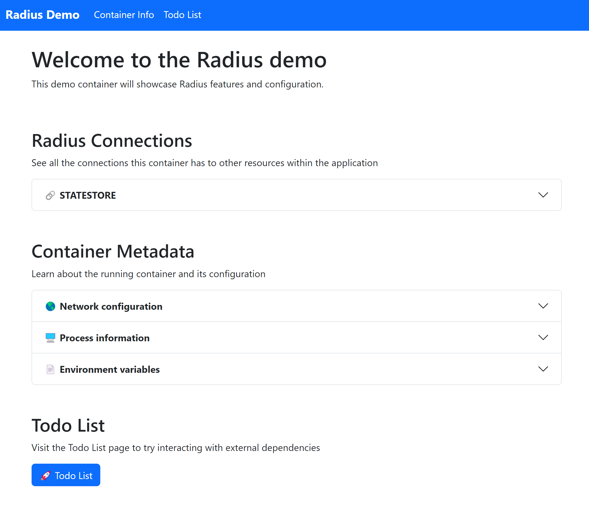

# Step 4: Deploy a Radius application

In this step you'll deploy a Radius application into your environment, leveraging the Recipes that we looked at in the previous step.

## Step 4.1: Define a new application

Let's begin in a new directory where you'll create a new Radius application:

```bash
mkdir demo && cd demo
```

Next, open a new file named `app.bicep` in Visual Studio Code:

```bash
code app.bicep
```

> If you're on macOS you may need to open it from Visual Studio Code directly if you haven't [setup the `code` command](https://code.visualstudio.com/docs/setup/mac#_launching-from-the-command-line).

Add the following content to the file:

```bicep
// Import the set of Radius resource types
// (Applications.Core, Applications.Dapr, etc.)
import radius as rad

@description('The environment ID to deploy the application and its resourcs into. Passed in automatically by the rad CLI.')
param environment string

resource application 'Applications.Core/applications@2023-10-01-preview' = {
  name: 'lab'
  properties: {
    environment: environment
  }
}
```

We now have a new application named "lab". Let's now add some resources to it.

## Step 4.2: Add a container

Let's add a container to our application. Add the following to the end of the `app.bicep` file:

```bicep
resource container 'Applications.Core/containers@2023-10-01-preview' = {
  name: 'demo'
  properties: {
    application: application.id
    container: {
      image: 'ghcr.io/radius-project/samples/demo:latest'
      ports: {
        web: {
          containerPort: 3000
        }
      }
    }
    extensions: [
      {
        kind: 'daprSidecar'
        appId: 'demo'
      }
    ]
  }
}
```

This will add a container to our application, using the `ghcr.io/radius-project/samples/demo:latest` image. This image is a simple Node.js application that serves a web page on port 3000. We'll also add the `daprSidecar` extension which will add a Dapr sidecar to our container.

## Step 4.3: Add a Dapr state store

Next, let's add a Dapr state store to our application. Add the following to the end of the `app.bicep` file:

```bicep
resource statestore 'Applications.Dapr/stateStores@2023-10-01-preview' = {
  name: 'statestore'
  properties: {
    environment: environment
    application: application.id
  }
}
```

> 💡 Developers don't need to think about underlying infrastructure in Radius. Instead, they think in terms of the dependencies and APIs they need. In this example, the developer asked for a Dapr state store, and will defer to the environment operator to define how the underlying infrastructure is deployed.

## Step 4.4: Add a connection

Central to Radius is the notion that applications are more than just lists of resources: they're also the relationships between them. Let's add a connection between our container and the state store, which not only documents the relationship but also allows Radius to automatically inject connection information into the container.

Update your container definition to look like the following:

```diff
resource container 'Applications.Core/containers@2023-10-01-preview' = {
  name: 'demo'
  properties: {
    application: application.id
    container: {
      image: 'ghcr.io/radius-project/samples/demo:latest'
      ports: {
        web: {
          containerPort: 3000
        }
      }
    }
+   connections: {
+     statestore: {
+       source: statestore.id
+     }
+   }
    extensions: [
      {
        kind: 'daprSidecar'
        appId: 'demo'
      }
    ]
  }
}
```

By this point, your `app.bicep` file should look like the following:

<details>
<summary>app.bicep</summary>

```bicep
// Import the set of Radius resource types
// (Applications.Core, Applications.Dapr, etc.)
import radius as rad

@description('The environment ID to deploy the application and its resourcs into. Passed in automatically by the rad CLI.')
param environment string

resource application 'Applications.Core/applications@2023-10-01-preview' = {
  name: 'lab'
  properties: {
    environment: environment
  }
}

resource container 'Applications.Core/containers@2023-10-01-preview' = {
  name: 'demo'
  properties: {
    application: application.id
    container: {
      image: 'ghcr.io/radius-project/samples/demo:latest'
      ports: {
        web: {
          containerPort: 3000
        }
      }
    }
    connections: {
      statestore: {
        source: statestore.id
      }
    }
    extensions: [
      {
        kind: 'daprSidecar'
        appId: 'demo'
      }
    ]
  }
}

resource statestore 'Applications.Dapr/stateStores@2023-10-01-preview' = {
  name: 'statestore'
  properties: {
    environment: environment
    application: application.id
  }
}
```

</details>

## Step 4.5: Deploy the application

We're now ready to deploy the application. Run the following command to deploy it:

```bash
rad deploy app.bicep
```

You should see the following output as the application is deployed:

```
Building .\app.bicep...
Deploying template '.\app.bicep' into environment 'default' from workspace 'default'...

Deployment In Progress...

Completed            lab             Applications.Core/applications
Completed            statestore      Applications.Dapr/stateStores
...                  demo            Applications.Core/containers

Deployment Complete

Resources:
    lab             Applications.Core/applications
    demo            Applications.Core/containers
    statestore      Applications.Dapr/stateStores
```

Woohoo! Our app is now deployed and running in our cluster.

## Step 4.6: View the App Graph

The rad CLI has a handy little utility that allows you to view the application graph. Run the following command to see it:

```bash
rad app graph lab
```

You should see a text-based representation of the application graph:

```
Displaying application: lab

Name: demo (Applications.Core/containers)
Connections:
  statestore (Applications.Dapr/stateStores) -> demo
Resources:
  demo (apps/Deployment)
  demo (core/Secret)
  demo (core/Service)
  demo (core/ServiceAccount)
  demo (rbac.authorization.k8s.io/Role)
  demo (rbac.authorization.k8s.io/RoleBinding)

Name: statestore (Applications.Dapr/stateStores)
Connections: (none)
Resources:
  daprstate-mw4r25gawcovc (apps/Deployment)
  daprstate-mw4r25gawcovc (core/Service)
  statestore (dapr.io/Component)
```

This output contains all of the resources in the `lab` app, along with the underlying Kubernetes resources that were deployed to support it.

You can validate these resources were deployed by running the following command:

```bash
kubectl get all -n default-lab
```

You should see all of the resources listed above running in your cluster:

```
kubectl get all -n default-lab
NAME                                           READY   STATUS    RESTARTS   AGE
pod/daprstate-mw4r25gawcovc-6544f8767d-cdpbg   1/1     Running   0          9m15s
pod/demo-7f84d9dcb7-nxfqt                      2/2     Running   0          9m5s

NAME                              TYPE        CLUSTER-IP    EXTERNAL-IP   PORT(S)                               AGE
service/daprstate-mw4r25gawcovc   ClusterIP   10.43.78.47   <none>        6379/TCP                              9m15s
service/demo-dapr                 ClusterIP   None          <none>        80/TCP,50001/TCP,50002/TCP,9090/TCP   9m5s
service/demo                      ClusterIP   10.43.36.46   <none>        3000/TCP                              8m41s

NAME                                      READY   UP-TO-DATE   AVAILABLE   AGE
deployment.apps/daprstate-mw4r25gawcovc   1/1     1            1           9m15s
deployment.apps/demo                      1/1     1            1           9m5s

NAME                                                 DESIRED   CURRENT   READY   AGE
replicaset.apps/daprstate-mw4r25gawcovc-6544f8767d   1         1         1       9m15s
replicaset.apps/demo-7f84d9dcb7                      1         1         1       9m5s

NAME                           AGE
component.dapr.io/statestore   9m15s
```

## Step 4.7: Run the application

When working with local Kubernetes clusters, it can be a bit tricky to figure out how to access your application and refer to logs. To help with this, you can use the `rad run` command to deploy the app and then automatically port forward and stream logs:

```bash
rad run app.bicep -a lab
```

This time, you'll see the same output, but now with logs and a port forward:

```
Building .\app.bicep...
Deploying template '.\app.bicep' for application 'lab' and environment 'default' from workspace 'default'...

Deployment In Progress...

Completed            lab             Applications.Core/applications
Completed            statestore      Applications.Dapr/stateStores
.                    demo            Applications.Core/containers

Deployment Complete

Resources:
    lab             Applications.Core/applications
    demo            Applications.Core/containers
    statestore      Applications.Dapr/stateStores

Starting log stream...

+ daprstate-mw4r25gawcovc-6544f8767d-cdpbg › redis
+ demo-7f84d9dcb7-nxfqt › demo
+ demo-7f84d9dcb7-nxfqt › daprd
redis 1:C 10 Jan 2024 01:06:39.153 * oO0OoO0OoO0Oo Redis is starting oO0OoO0OoO0Oo
redis 1:C 10 Jan 2024 01:06:39.153 * Redis version=7.2.3, bits=64, commit=00000000, modified=0, pid=1, just started
daprd time="2024-01-10T01:07:03.592463327Z" level=info msg="Starting Dapr Runtime -- version 1.12.3 -- commit 60de5b8c66190212b0f882c3737015e0561e4785" app_id=demo instance=demo-7f84d9dcb7-nxfqt scope=dapr.runtime type=log ver=1.12.3
demo Using in-memory store: no connection string found
daprd time="2024-01-10T01:07:03.592508892Z" level=info msg="Log level set to: info" app_id=demo instance=demo-7f84d9dcb7-nxfqt scope=dapr.runtime type=log ver=1.12.3
demo Server is running at http://localhost:3000
```

## Step 4.8: Interact with the application

Open a browser and navigate to http://localhost:3000 to see the application running. You should see a demo app which tells you a little bit about the application and the environment it's running in. You'll see the set of environment variables that were injected into the container, including the connection information for the Dapr state store.



Once you're done, you can press `Ctrl+C` to stop the `rad run` command.

## Step 4.9: Delete your application

Before moving onto the next step, make sure to delete your application to cleanup any resources that were deployed:

```bash
rad app delete lab -y
```

## Next step

Now that you've deployed your first Radius application, let's move on to the next step where you'll deploy the same application to Azure, without any code or template changes to the app. [Next: Step 5: Deploy to Azure](./05-azure.md).